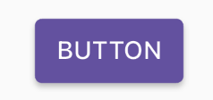
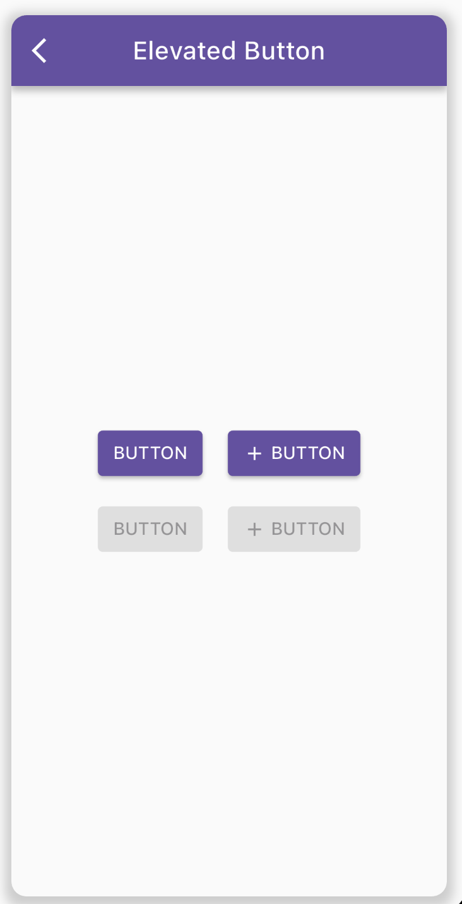

# Elevated Button

Mirai uses flutter `ElevatedButton` widget from the Material components. The main characteristic these buttons hold is the slight elevation in their surface towards the screen on getting tapped by the user.

## Flutter Elevated Button 

An elevated button is a label child displayed on a Material widget whose Material.elevation increases when the button is pressed. The label's Text and Icon widgets are displayed in style's `ButtonStyle.foregroundColor` and the button's filled background is the `ButtonStyle.backgroundColor`.

```dart
ElevatedButton(
    style: style,
    onPressed: () => 
        Navigator.of(context).push(MaterialPageRoute(builder: (context) => 
            const NewScreen())),
    child: const Text('Navigate'),
)
```

### Styling a Button

Styling for elevated button is done using ElevatedButton.styleFrom. Specific styling for a button explicitly is done using ButtonStyle parameter as given below:

```dart
ElevatedButton(
    child: Text('Elevated Button'),
    style: ElevatedButton.styleFrom(
    primary: Colors.green,
    ),
    onPressed: () {},
),
```

## Reference

### Model

`MiraiElevatedButton` model is a [@freezed](https://pub.dev/packages/freezed) type class defined in dart for the json model vlaues in the `Mirai` widget json. This model will bind the json values into a flutter elevated button with all the properties. The properties are listed below:


| Parameter    | Type                                                                                                                                                     | Description                                                                                                       |
| ------------ | -------------------------------------------------------------------------------------------------------------------------------------------------------- | ----------------------------------------------------------------------------------------------------------------- |
| onPressed    | [MiraiAction](https://github.com/Securrency-OSS/mirai/blob/fc59f8e5d0055fd49288232e4eb90221700614a9/packages/mirai/lib/src/action/mirai_action.dart#L10) | Defines call to action for the on pressed                                                                         |
| style        | [MiraiButtonStyle](https://github.com/Securrency-OSS/mirai/blob/main/packages/mirai/lib/src/parsers/mirai_button_style/mirai_button_style.dart)          | Defines button styling and theming                                                                                |
| autofocus    | `bool`                                                                                                                                                   | `True` if this widget will be selected as the initial focus when no other node in its scope is currently focused. |
| clipBehavior | `Clip`                                                                                                                                                   | Defines different ways to clip a widget's content.                                                                |
| child        | `Map<String, dynamic>`                                                                                                                                   | Typically the button's label. This widget can only have one child.                                                |


### Parser 

`MiraiElevatedButton` parser is an extension on [`MiraiParser`](https://github.com/Securrency-OSS/mirai/blob/main/packages/mirai/lib/src/framework/mirai_parser.dart) model which typically looks like this, which has a type, a getModel from json and a parse method that converts the `freezed` model to a flutter widget.

`MiraiElevatedButton` parser type is named `elevatedButton` and it used `child: Mirai.fromJson(model.child, context)` for the creating an elevated button using the values from data model. 

For more details please check out [this](https://github.com/Securrency-OSS/mirai/blob/main/packages/mirai/lib/src/parsers/mirai_elevated_button/mirai_elevated_button_parser.dart). 

## Usage 

### In Json models 

In widget Json we can add the `MiraiElevatedButton` model simply by specifying the widget type.

```json
"type": "elevatedButton",
"child": {
    "type": "text",
    "data": "BUTTON"
},
```

You can also add the button styling by using the style value in the button json.

```json
"type": "elevatedButton",
"child": {
    "type": "text",
    "data": "BUTTON"
},
"style": {
    "padding": {
        "top": 8,
        "left": 12,
        "right": 12,
        "bottom": 8
    }
}
```



Similary, you can design an elevated button with leading and trailing icons.

```json
{
    "type": "elevatedButton",
    "child": {
        "type": "text",
        "data": "BUTTON"
    },
    "style": {
        "padding": {
            "top": 8,
            "left": 12,
            "right": 12,
            "bottom": 8
        }
    },
    "onPressed": {}
},
{
    "type": "elevatedButton",
    "child": {
        "type": "row",
        "children": [
            {
                "type": "icon",
                "iconType": "material",
                "icon": "add",
                "size": 18
            },
            {
                "type": "sizedBox",
                "width": 4
            },
            {
                "type": "text",
                "data": "BUTTON"
            }
        ]
    },
    "style": {
        "padding": {
            "top": 8,
            "left": 12,
            "right": 12,
            "bottom": 8
        }
    },
    "onPressed": {}
},
{
    "type": "elevatedButton",
    "child": {
        "type": "text",
        "data": "BUTTON"
    },
    "style": {
        "padding": {
            "top": 8,
            "left": 12,
            "right": 12,
            "bottom": 8
        }
    }
},
{
    "type": "elevatedButton",
    "child": {
        "type": "row",
        "children": [
            {
                "type": "icon",
                "iconType": "material",
                "icon": "add",
                "size": 18
            },
            {
                "type": "sizedBox",
                "width": 4
            },
            {
                "type": "text",
                "data": "BUTTON"
            }
        ]
    },
    "style": {
        "padding": {
            "top": 8,
            "left": 12,
            "right": 12,
            "bottom": 8
        }
    }
}
```

